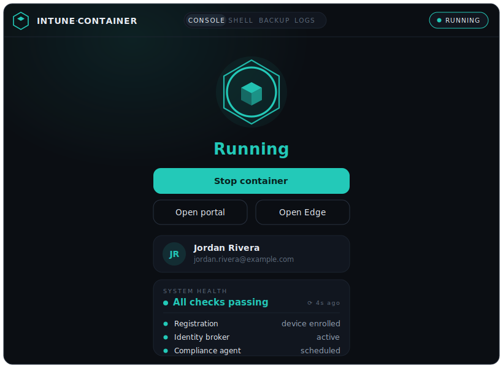

<!--
HERO IMAGE
The banner lives at docs/assets/hero.jpg.
-->
<p align="center">
  
</p>

<h1 align="center">intune-container</h1>

<p align="center">
  <em>Microsoft Intune in an isolated, rootless Linux container —
  headless by default, with seamless Entra ID SSO in your host browser.</em>
</p>

<p align="center">
  📖 <a href="https://magicabdel.github.io/intune-container/"><b>Documentation</b></a>
  · <a href="https://magicabdel.github.io/intune-container/quickstart/">Quickstart</a>
  · <a href="https://magicabdel.github.io/intune-container/architecture/">Architecture</a>
  · <a href="https://magicabdel.github.io/intune-container/roadmap/">Roadmap</a>
</p>

---

Intune's Linux agent and the Microsoft identity broker are desktop apps that
make broad changes to a host. **intune-container** runs them in a dedicated,
**rootless** container — built from unprivileged user namespaces, with **no host
root and no `sudo`** — so your host stays clean. A tiny native-messaging bridge
then lets your everyday browser use the container's enrollment to sign in to
Teams, Outlook, and other M365 apps. Works on any Wayland compositor (niri,
Hyprland, Sway, GNOME, KDE) and X11.

## Quick start

Install the latest AppImage to `~/.local/bin`:

```sh
curl -fsSL https://raw.githubusercontent.com/magicabdel/intune-container/master/install.sh | sh
```

Prefer a package or building yourself? Grab the `.deb`/`.rpm` from the
[releases](https://github.com/magicabdel/intune-container/releases/latest), or
build from source (needs Rust, Node.js + npm, and WebKitGTK/GTK):

```sh
just install   # builds + installs `intune-container` (GUI + CLI in one binary)
```

Run it with **no subcommand** to open the graphical interface (the default) and
click **Enroll this device**. Set-up, the portal, Edge, browser SSO, live health
and backups are all there; closing the window keeps it running in your tray:

```sh
intune-container          # opens the GUI
```

The same binary is the command-line tool when given a subcommand:

```sh
intune-container enroll   # set up + enroll your device (opens the portal)
intune-container start    # (optional) run headless + seamless Teams/M365 SSO
```

Daily CLI use: `edge` · `status` · `doctor` · `stop`. Full walkthrough in the
**[Quickstart](docs/quickstart.md)**.

The default container image is publicly hosted and ready to go (it already
includes everything for headless SSO) — there's nothing to build, and no
container engine is needed: the image is pulled with a built-in OCI client.

> **Requirements:** a Linux host with **unprivileged user namespaces enabled**,
> a `/etc/subuid` + `/etc/subgid` range for your user, `newuidmap`/`newgidmap`
> (the `uidmap`/`shadow` package), and **cgroup v2**. No `sudo`, `systemd-nspawn`,
> `machinectl`, `nsenter`, Docker, or Podman. **Building from source needs**
> Rust + `just`, and **Node.js + npm** — the interface is a TypeScript / React /
> Emotion app (in `frontend/`) that Tauri bundles into the binary at compile
> time. **At runtime the GUI needs** WebKitGTK 4.1, and — for the system tray —
> `libayatana-appindicator` (`libappindicator-gtk3` on some distros); without it
> the GUI still runs as a plain window (no tray).

## The interface

<p align="center">
  
</p>

A tray-resident Tauri desktop app. The **Console** shows the container's state,
the few actions you actually use (start/stop, open the portal, open Edge), the
signed-in identity, and **live health checks** — the same data `doctor` and
`sso-test` report. Other tabs give you an in-app **Shell** (a real terminal
inside the container), **Backup**/restore, **Logs**, and **Destroy**. From the
tray: single-click for a quick panel, double-click for the full window, and a
status-tinted icon that tracks the container (grey = stopped, teal = running,
amber = display attached).

> The preview above is an illustrative render with placeholder data — the real
> interface shows your own status and account.

## Architecture at a glance

A single crate produces a single `intune-container` binary that is **both** the
graphical interface (default) and the command-line tool:

| Part | Role |
|------|------|
| `src/lib.rs` (library) | All logic — container lifecycle, enroll, SSO, backups, health checks — exposed as Rust functions in `ops`. |
| `src/runtime.rs` | The rootless runtime: user namespaces, `setns`, a delegated cgroup scope, `pivot_root` — no host root. |
| `src/main.rs` (binary) | clap dispatch: no subcommand → GUI; any subcommand → CLI. |
| `src/gui.rs` | The Tauri shell: window, tray, and typed commands that call `ops`. |
| `frontend/` | The interface itself — TypeScript + React + Emotion (Vite), bundled into the binary. |

Both the GUI and CLI call the same `ops` functions **in-process** — neither
shells out, and neither needs elevated privilege.

## Features

### ✅ Available now

- [x] **Rootless** — boots the container's `systemd` inside an unprivileged user
  namespace; no host root, no `sudo`, no `systemd-nspawn`/`machinectl`/`nsenter`.
- [x] **Headless by default** — no window into your screen; the real display is
  forwarded only for the interactive portal and Edge flows.
- [x] **Seamless host-browser SSO** — Teams/Outlook/M365 sign in automatically
  via the container's enrollment (no Python, no proxy daemon, no host bus).
- [x] **Compositor-agnostic** — auto-detects Wayland, abstract X11, and
  Xauthority; no hardcoded socket names.
- [x] **One-command enroll** — provision, boot, and open the portal in one step.
- [x] **Enrollment backup/restore** — survive container rebuilds without
  re-enrolling.
- [x] **Microsoft Edge** in the container, with display/GPU passthrough during
  GUI sessions.
- [x] **Live health checks** (`doctor`) — registration, container, network,
  broker, keyring, and the compliance agent, surfaced right in the interface.
- [x] **Graphical interface (default)** — a tray-resident Tauri app: Console,
  in-app Shell, Backup/restore, Logs, and Destroy tabs, with a status-tinted
  tray icon and quick actions. Closing the window keeps it in the tray.
- [x] **One binary, two faces** — a single `intune-container` executable is both
  the GUI (no subcommand) and the CLI (any subcommand), sharing one library.

### 🔲 Planned

- [ ] **Private network namespace** — the container currently shares the host
  network; a private netns with userspace egress (and LAN/localhost blocked)
  would close the main isolation gap (see the [Roadmap](docs/roadmap.md)).
- [ ] **Live display attach** — attach the host display to an already-running
  headless container without a restart.

## Compositor support

| Compositor | Status | Notes |
|------------|:------:|-------|
| Niri | ✅ | Abstract X11 sockets auto-detected |
| Hyprland | ✅ | Standard XWayland |
| Sway | ✅ | Standard XWayland |
| GNOME | ✅ | Mutter Xauthority auto-detected |
| KDE | ✅ | Standard Xauthority |

## Credits & inspiration

This project stands on the shoulders of two excellent projects:

- **[frostyard/intuneme](https://github.com/frostyard/intuneme)** — the original
  `systemd-nspawn`-based Intune manager that inspired this container approach
  (and the base OCI image).
- **[siemens/linux-entra-sso](https://github.com/siemens/linux-entra-sso)** — the
  browser extension and native-messaging protocol that make host SSO work;
  this project ships a compatible native-messaging host. Install the extension
  from its [releases](https://github.com/siemens/linux-entra-sso/releases/).

## Disclaimer

This is a personal, educational tool for running Microsoft Intune in an isolated
container — for example, to keep corporate device management off your personal
Linux machine. It is **not** intended to bypass, defeat, or misrepresent your
organization's device-management or compliance controls, and it does not modify
or weaken Intune or Entra ID themselves.

You are responsible for using it in line with your employer's acceptable-use and
security policies and your Microsoft licensing terms. If you're unsure whether
this is permitted in your environment, check with your IT/security team first.
Provided as-is, with no warranty.

## License

Source is [MIT](LICENSE). It automates **Microsoft proprietary** software
(`intune-portal`, `microsoft-edge`, the identity broker) and integrates with
`linux-entra-sso` (MPL-2.0); those have their own terms and require a valid
Intune / Microsoft 365 subscription.
