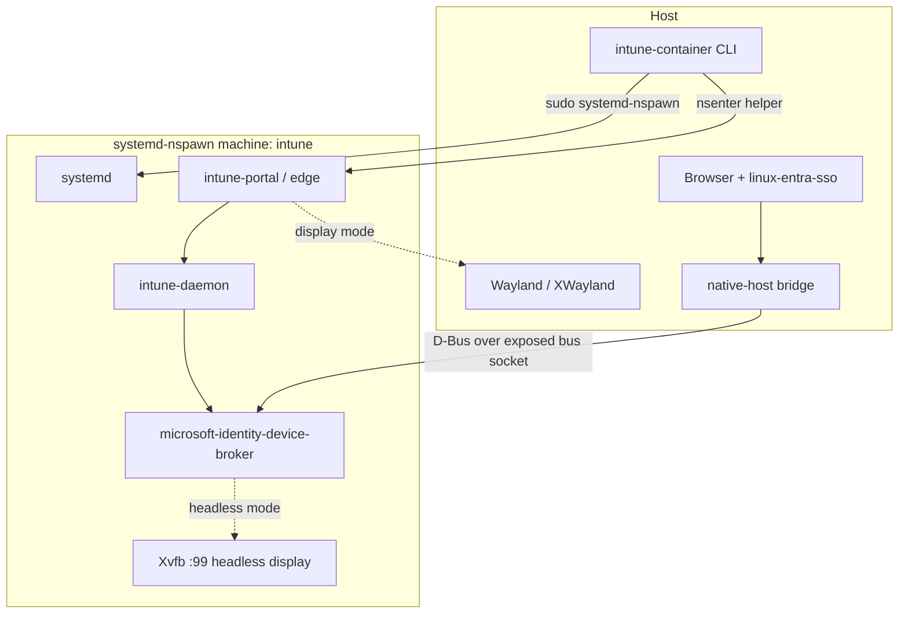
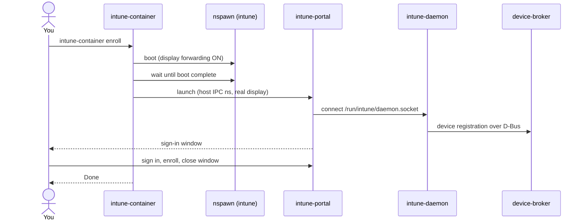
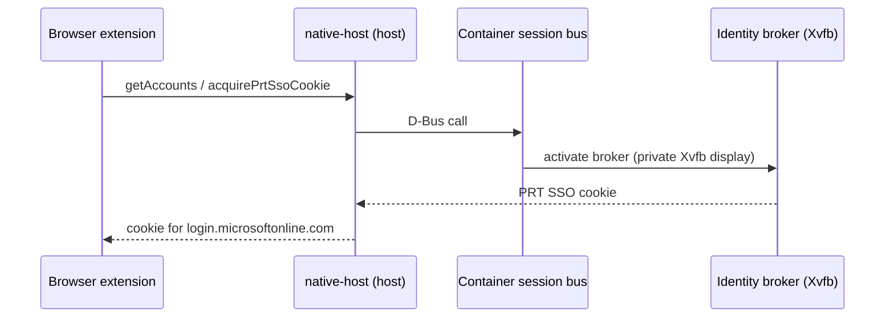
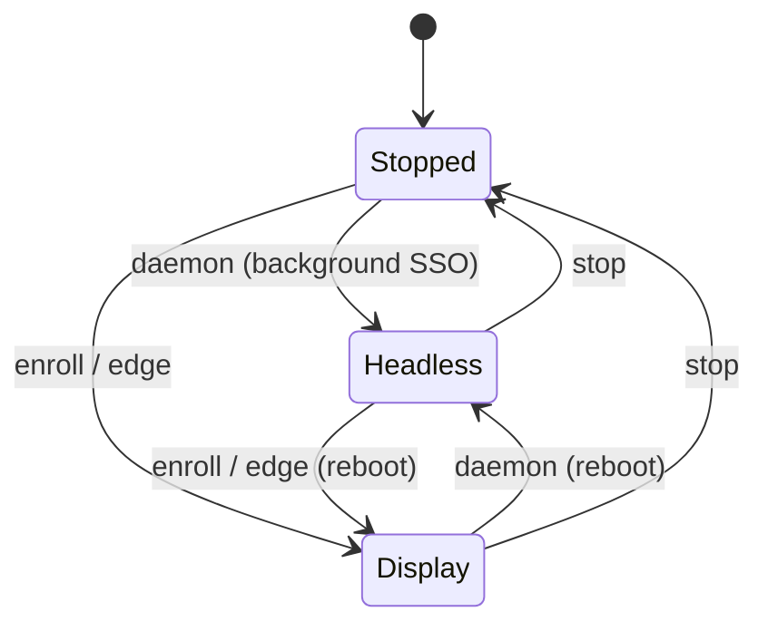

# Architecture

`intune-container` is a host-side Rust CLI that drives a single
`systemd-nspawn` machine named `intune`. The CLI never reimplements Microsoft's
components — it provisions the container, controls its boot mode, and bridges
just enough to the host for the portal UI and browser SSO.

## Components

- The **CLI** boots the machine (`sudo systemd-nspawn`) and launches GUI apps
  through a small, root-owned **nsenter helper** authorized by a single
  passwordless sudoers rule.
- The **native-host bridge** is the same binary in `native-host` mode, spawned
  by the browser. It speaks the `linux-entra-sso` native-messaging protocol and
  forwards to the container's identity broker over the exposed session bus.
- Enrollment state lives on the **host** (bind mounts), so it survives rebuilds.

## Enroll flow

The portal renders with X shared memory (MIT-SHM) against the host's X server,
so display GUI apps run in the **host IPC namespace** (the nsenter helper drops
`-i`); otherwise they crash with an X11 `BadAccess`. The headless path keeps the
container's private IPC namespace.

## Headless browser SSO

## Display / boot modes

There is one machine; its mode is fixed at boot (bind mounts can't change on a
running machine), so switching modes **reboots** it. Enrollment state persists
across reboots; a running session of the other mode does not.

## Isolation model

- **Display:** headless by default; the real display + GPU are bound only for
  `enroll`/`edge`.
- **Filesystem:** the container has its own rootfs; only `~/Intune`, the
  device-state dirs, and (for SSO) a bus-socket directory are bind mounted.
- **Network:** **shared with the host** (no `--private-network`). The container
  can reach `localhost` services and host-local abstract sockets regardless of
  display mode. This is the main isolation gap — see the [Roadmap](roadmap.md).

For the full trust model (the passwordless helper, the host IPC namespace for
display apps, token storage), see `SECURITY.md` in the repository.
