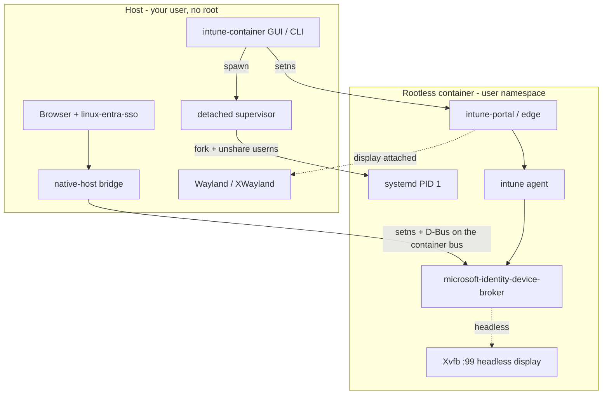
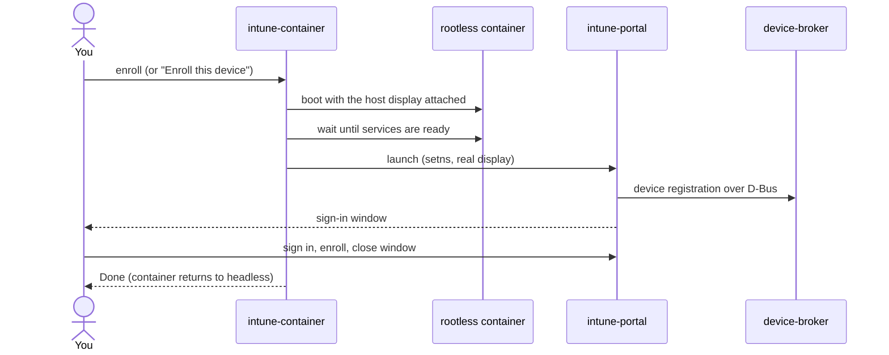
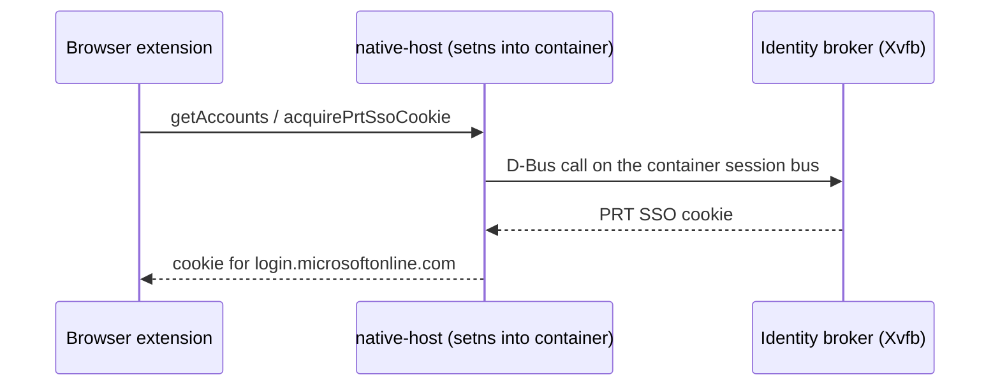
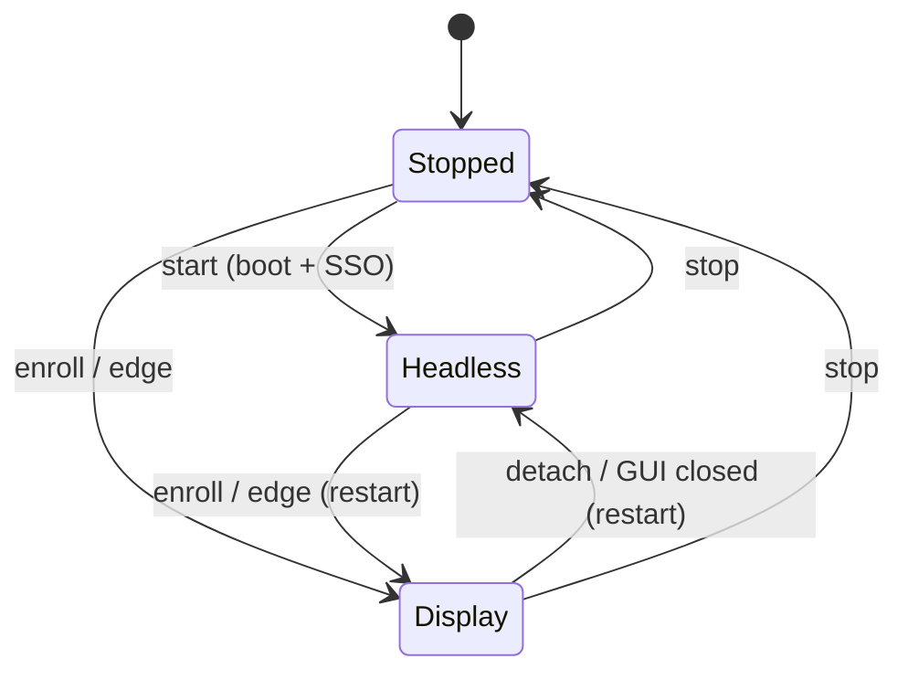

# Architecture

`intune-container` is a host-side Rust program that runs a single, **rootless**
container — the rootfs's `systemd` booted inside an unprivileged user namespace,
with no host root. It never reimplements Microsoft's components; it provisions
the container, controls its boot mode, and bridges just enough to the host for
the portal UI and browser SSO.

## Components

- The **GUI/CLI** spawn a detached **supervisor** process that `fork`s, creates
  an unprivileged user namespace (`unshare(CLONE_NEWUSER|NEWNS|NEWPID|NEWUTS)`,
  multi-id mapped via `newuidmap`/`newgidmap`), gets a **delegated cgroup scope**
  from the user's systemd manager over D-Bus, `pivot_root`s into the rootfs, and
  `exec`s the rootfs's `/sbin/init`. No host root, no `sudo`.
- Other commands **enter** the running container with `setns` (joining its
  user/mount/pid/… namespaces) — there is no `nsenter` helper and no setuid
  binary.
- The **native-host bridge** is the same binary, spawned by the browser. It
  `setns`-enters the container and speaks the `linux-entra-sso` native-messaging
  protocol to the identity broker on the container's **own** session bus — the
  host bus is never exposed.
- In-container apps run as the container's **root**, which the id-map points at
  your unprivileged host user, so host-owned resources (the Wayland socket, the
  persistence store) are reachable and anything created stays owned by you.
- Enrollment state lives in a **persistent store outside the rootfs**, bound in
  at boot, so it survives rebuilds.

## Enroll flow

GUI apps render with X shared memory (MIT-SHM) against the host's X server, so
the **display profile keeps the host IPC namespace shared** (a private IPC ns
makes the host X server unable to attach the container's shared-memory segment →
an X11 `BadAccess`). The **headless profile** uses a private IPC namespace.

## Headless browser SSO

## Display / boot modes

There is one container; the display sockets are bound at boot (and the IPC
profile is fixed there), so attaching or detaching the host display currently
**restarts** it. Enrollment state persists across restarts. Headless is the
default; the display is attached only for the portal and Edge, and detached
again when those close.

## Single instance & lifecycle

- The **supervisor** holds a process-lifetime singleton lock, so however many
  times you launch the app, there is **at most one** running container.
- A cross-process **lifecycle lock** serializes boot/stop so concurrent commands
  (including the browser-spawned native host) can't race.
- The GUI uses `tauri-plugin-single-instance`: a second launch focuses the
  existing window instead of starting a duplicate.

## Isolation model

- **Display:** headless by default; the real display is bound only for the
  portal and Edge.
- **Filesystem:** the container has its own rootfs; only the display sockets and
  the persistence store are bound in.
- **IPC:** private in the headless profile; shared with the host in the display
  profile (required for XWayland MIT-SHM).
- **Network:** **shared with the host.** The container reaches `localhost`
  services and host-local abstract sockets regardless of display mode. This is
  the main isolation gap — see the [Roadmap](roadmap.md).
- **Privilege:** rootless. The container's "root" maps to your unprivileged host
  user, so the container is **not** a privilege boundary beyond your own account
  — it keeps the Intune agent off your host, but a process that escapes it has
  whatever access your user has (shared network included).
