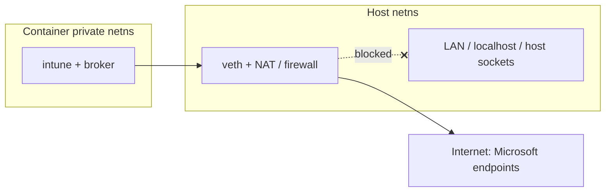

# Roadmap

## Network isolation (the main gap)

Today the container **shares the host network namespace** (started without
`--private-network`, with the host resolver copied in). This is convenient — the
container reaches the internet exactly as your user does — but it means the
container can also reach `localhost` services and host-local *abstract* UNIX
sockets (including a compositor's XWayland socket) regardless of whether a
display is bound. Headless mode removes the *display* binding, not this network
reachability.

The plan is to give the container its **own** network namespace and route it
through a controlled NAT, coupled to the display mode:

### Approach

1. **Private netns by default for headless** (`daemon` / background SSO): start
   the machine with `--private-network`, create a veth pair, NAT egress to the
   internet, and **block RFC1918 / link-local / `localhost`** so the container
   can't reach your LAN or host-local sockets. DNS via a public resolver
   (e.g. `1.1.1.1`) or a forwarder.
2. **Keep shared netns for `enroll` / `edge`** initially: those forward the real
   display, which on some compositors relies on the abstract X socket reachable
   through the shared network namespace. Coupling private-netns to headless mode
   avoids breaking the GUI flows while still hardening the long-running
   background path.
3. **Teardown** the veth/NAT rules on stop, since the host isn't assumed to run
   `systemd-networkd`.

### Open questions

- Host firewall stack to integrate with (nftables / iptables / firewalld).
- Behaviour under a host VPN (split tunnel vs. full tunnel).
- Whether display GUI flows can also move to private netns once display
  forwarding no longer depends on the shared namespace.

## Other planned work

- **No-restart mode switching** via `machinectl bind`: keep one always-headless
  container and attach the display on demand for `enroll`/`edge`, so launching a
  GUI flow no longer tears down a running `daemon` SSO session.
- **Preflight checks**: verify `systemd-nspawn`, `machinectl`, a container
  engine, `nsenter`, and cgroup v2 up front with a single actionable error.
- **CI**: lint/test/build on every PR (see the repository workflows).

!!! note
    Until private networking lands, treat the container as having the same
    network reach as your user. See `SECURITY.md` for the current trust model.
