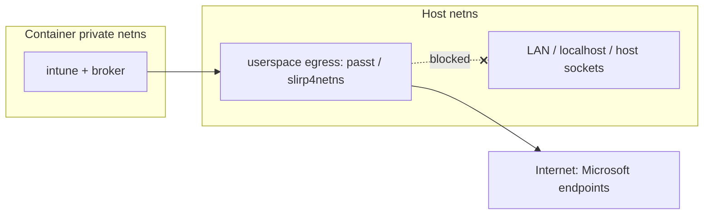

# Roadmap

## Network isolation (the main gap)

Today the container **shares the host network namespace** (no `CLONE_NEWNET`,
with the host resolver copied in). This is convenient — the container reaches
the internet exactly as your user does — but it means the container can also
reach `localhost` services and host-local *abstract* UNIX sockets (including a
compositor's XWayland socket) regardless of whether a display is bound. Headless
mode removes the *display* binding, not this network reachability.

The plan is to give the container its **own** network namespace with userspace
egress, coupled to the display mode:

### Approach

1. **Private netns for the headless container**: add `CLONE_NEWNET` and provide
   egress through a userspace proxy (`passt` or `slirp4netns`) — no host root or
   `CAP_NET_ADMIN` needed — so the container reaches the internet but **not** the
   LAN, `localhost`, or host-local abstract sockets. DNS via the proxy.
2. **Keep shared netns for the portal / Edge** initially: those forward the real
   display, which on some compositors relies on the abstract X socket reachable
   through the shared network namespace. Coupling private-netns to headless mode
   hardens the long-running background path without breaking the GUI flows.
3. The `setns`-based SSO bridge already joins the container's namespaces, so it
   keeps working when the netns becomes private.

### Open questions

- Whether to bundle a `passt`/`slirp4netns` dependency or detect it at runtime.
- Behaviour under a host VPN (split tunnel vs. full tunnel).
- Whether the display GUI flows can also move to a private netns once display
  forwarding no longer depends on the shared namespace.

## Other planned work

- **Live display attach**: attach the host display to an already-running
  headless container without a restart. The display sockets are currently bound
  at boot, so attaching/detaching restarts the container; doing it live needs a
  `setns` bind-mount (and a shared IPC namespace for XWayland).
- **Deeper hardening of the headless profile**: a seccomp allow-list, a dropped
  capability bounding set, `no_new_privs`, a curated `/dev`, and an
  AppArmor/SELinux profile.

## Already shipped

- **Rootless runtime**: the container boots inside an unprivileged user
  namespace via a detached supervisor — no host root, no `sudo`,
  `systemd-nspawn`, `machinectl`, or `nsenter`.
- **Single instance**: a supervisor singleton lock guarantees at most one
  running container, and the GUI focuses an existing window instead of starting
  a duplicate.
- **Preflight checks**: `enroll`/`status` fail fast with a clear error when
  unprivileged user namespaces are disabled, no `/etc/subuid` range exists, or
  cgroup v2 isn't mounted.
- **cgroup resource limits**: the container's delegated scope caps process count
  (and, headless, memory), so a runaway can't exhaust your session.

!!! note
    Until private networking lands, treat the container as having the same
    network reach as your user.
